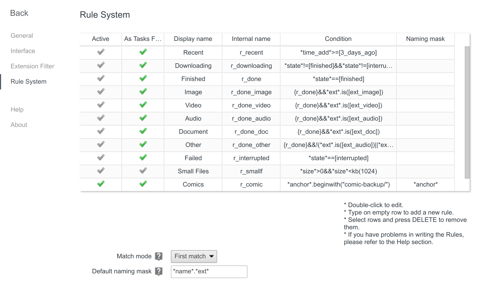

Comic Backup
======

This is a Chrome/Chromium extension, that allows you to download all the comics you bought on ~~Comix~~ *a popular online comic platform* :wink:. After the installation you are able to download comics from any publisher. It should work on any OS where Chrome works.

*IMPORTANT:* Do not use the extension for piracy! Only create private backups! We do not intend to compromise any comic platform. **Downloaded comics always have your username included. Distributed comics can be tracked back to you!**

Installation
-----

The installation is slightly complicated (since I don't want to add this to the Chrome Store).

- In Chrome, click on the settings icon on the right (looks like three vertical lines on top of each other)
- Select Tools > Extensions
- Select "Developer mode"
- Click on "Load unpacked extension"
- Select the "source" folder
- Done. :tada:

### Updates

If you want to be notified about updates you can add an update server in the extensions options. You get there by opening the extensions panel in the settings and then click on "Options" right to the Comic Backup extension. The options should open and you should see an input field in the Updates section.

The default update server URL is: `https://raw.githubusercontent.com/Cortys/comic-backup/master`

### Why it's not on Chrome Store?

I am fairly certain that *certain comic platforms* will, unfortunately, try to remove this extension from Chrome Store, because it goes around their DRM.

How to use
-----

* Install the extension as described above.
* Open your online comic library by clicking on "My Books" in the menu.
* To start a backup simply click the "Scan Comic" button, that should now appear next to each comic.
* Some comics also offer a direct PDF and CBZ download. Those are official high quality downloads available for a selection of publishers.
* Sometimes backups of comics with many pages (~200+) fail. To circumvent that you can enable *single image* container compression in the options and all the pages of the comic will be downloaded as separate images. To get a CBZ you then have to zip the images manually.

It's not working! Help!
----
***What to do first?*** Some problems can be resolved by taking a look at the *Options* of the extension.

***This did not help! All downloaded files have cryptic names like `33984c2d-3fb2-46c3-a8f2-f1982ca0d2fa`. What to do?*** You are probably using a download manager like [Chrono Download Manager](https://www.chronodownloader.net/). You'll have to teach it to play together nicely with this extension. In *Chrono* this can be done by adding a rule like this:

* Condition: `*anchor*.beginwith("comic-backup/")`
* Naming mask: `*anchor*`

***That also didn't help!*** :confused: Please open an issue on GitHub then.

How it works
-----
You can look at the source code - but basically, if you start a scan it opens the web reader in the background and automatically navigates through all the pages. For every page it fetches the pixel data from the corresponding underlying canvas elements in the reader's DOM. Finally it downloads all the fetched data as a CBZ using zip.js or as single image blobs using JavaScript-Canvas-to-Blob.

About, licence
----

Project started by SpergLord Enterprises, LLC and continued by other awesome contributors.

The code is licensed under GPLv3.

It uses these awesome projects:
* [zip.js](https://github.com/gildas-lormeau/zip.js) by Gildas Lormeau
* [JavaScript-Canvas-to-Blob](https://github.com/blueimp/JavaScript-Canvas-to-Blob) by Sebastian Tschan
* [Toastr](https://github.com/CodeSeven/toastr) by CodeSeven
* [League Gothic](https://github.com/theleagueof/league-gothic) by Caroline Hadilaksono, Micah Rich, & Tyler Finck
